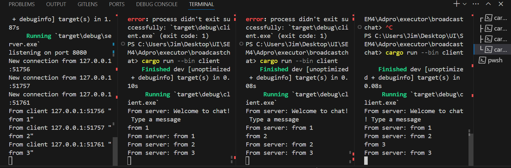
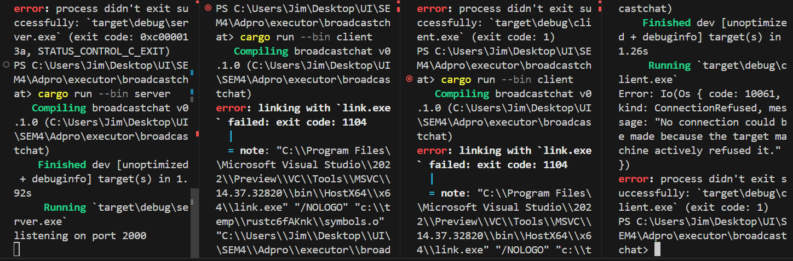
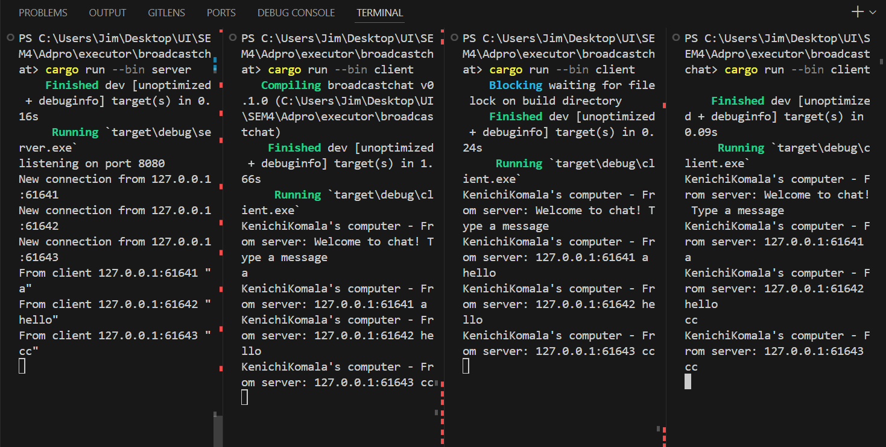
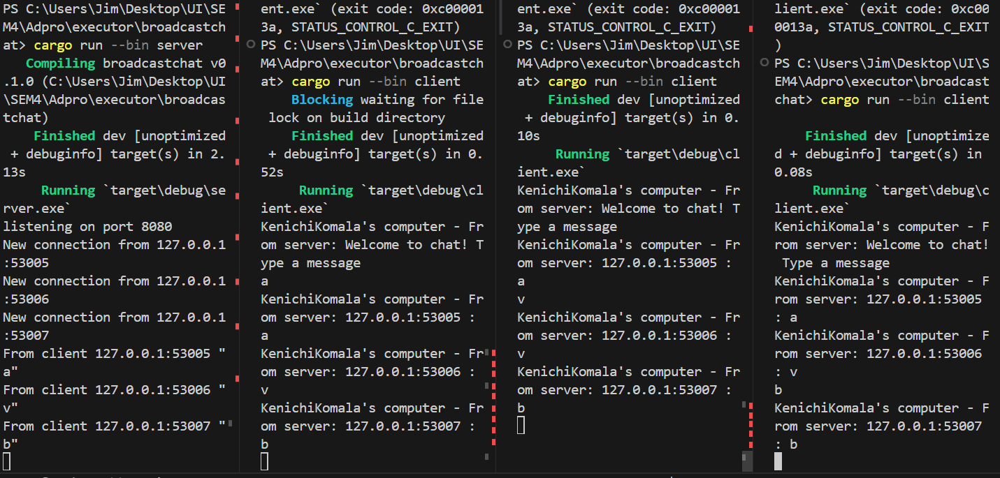

### 2.1. Original code of broadcast chat

Setelah server di-run dengan command "cargo run --bin server" dan tiap-tiap client di-run degan command "cargo run --bin client", dari hasil output diatas terlihat kalau tiap client dan juga server mendapatkan chat broadcast-an dari masing-masing client. Tiap kali suatu client mengetikan pesan di command line, string tersebut akan terkirim ke server dan server akan lanjut mengirimkannya ke semua client yang terkoneksi dengannya.

### 2.2. Modifying the websocket port
Ketika client dan server memiliki port yang sama maka aplikasi akan berjalan dengan baik baik saja sama seperti sebelumnya, dimana dapat dilihat pada gambar dibawah ini.

Namun, jika misal kita hanya mengganti salah satu port misal port client, maka akan terjadi error pada client karena menurut client port tersebut tidak memiliki koneksi dan program akan crash saat diberikan command "cargon run --bin client" seperti dengan foto dibawah ini

### 2.3. Small changes. Add some information to client

Hasil pada foto diatas dicapai dengan mengubah code di bin/server.rs menjadi seperti berikut.

Perubahan tersebut dibuat agar saat bcast.tx ( yang merupakan sender ) mengirimkan pesan ke tiap-tiap subscribernya akan di berikan juga IP pengirim dari text tersebut melalui variabel addr.