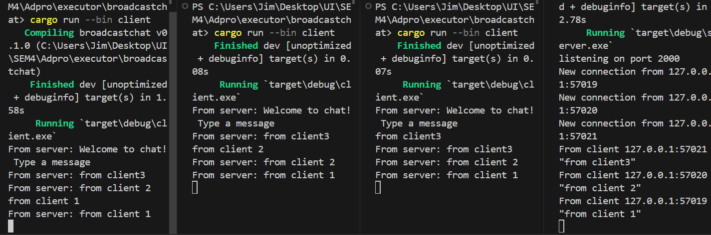

### 2.1. Original code of broadcast chat

Setelah server di-run dengan command "cargo run --bin server" dan tiap-tiap client di-run degan command "cargo run --bin client", dari hasil output diatas terlihat kalau tiap client dan juga server mendapatkan chat broadcast-an dari masing-masing client. Tiap kali suatu client mengetikan pesan di command line, string tersebut akan terkirim ke server dan server akan lanjut mengirimkannya ke semua client yang terkoneksi dengannya.